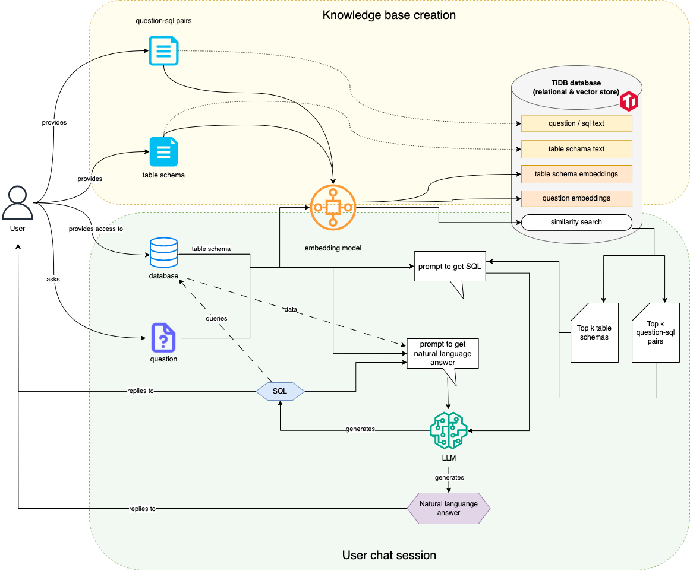

# 1. About

This application enables users to ask questions and troubleshoot their database by leveraging Large Language Models (LLMs) for answers. With Retrieval-Augmented Generation (RAG), users can create a custom knowledge base of question-SQL pairs, allowing each user to have a personalized knowledge base that enhances prompt generation for more accurate and tailored LLM responses.


## 1.1 Architecture



1. Embedding Model:
   Responsible for generating embeddings for both table schema text and question/SQL text.
2. TiDB Database:
   Acts as a combined relational and vector store, supporting similarity searches and storing embeddings.
3. Prompt Generation:
   Two distinct prompts are generated during the process:
   - Prompt to Get SQL: Used to create a SQL query based on the user’s question and relevant data.
   - Prompt to Get Natural Language Answer: Used to generate a natural language response after processing the SQL data.
4. LLM (Large Language Model):
   Used for generating SQL queries and natural language answers based on the user’s question and retrieved data.
5. Chat Interface:
   The primary user interface where the user interacts, asks questions, and receives responses.

# 2. Deployment

## 2.1 Backend

1. Setup environment by creating .env file in backend directory based on .env.example
2. Create docker container
   ```
   > docker compose up -d
   ```

## 2.2 Frontend

1. Setup environment by creating .env file in frontend directory based on .env.example
   - VITE_API_URL is the backend endpoint created. It should be set as http://your-ip:5050
   - VITE_CLERK_PUBLISHABLE_KEY is the API key for your app. Follow the steps in https://clerk.com/docs/quickstarts/setup-clerk to create a Clerk application and get an API key
2. Installation
   ```
   > cd frontend
   > npm install
   > npm run start
   ```
3. Access web at http://your-ip:3000
